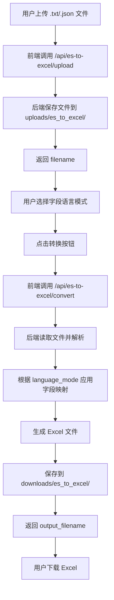

# ES to Excel 字段中英文映射功能需求设计文档

## 📋 需求概述

### 1.1 背景
当前系统已实现 ES 查询结果转 Excel 功能（访问路径：`http://8.146.228.47:5173/es-to-excel`），支持将 Elasticsearch 查询结果转换为 Excel 表格，并具备基础的字段中英文映射能力。

### 1.2 需求目标
基于现有架构，增强字段映射功能，实现以下目标：
1. **双向映射支持**：不仅支持英文→中文的转换，也支持中文→英文的反向转换
2. **适用配置复用**：沿用现有的 `es_field_mapping` 表数据结构和管理界面
3. **灵活切换**：用户可在转换时自由选择使用中文或英文作为 Excel 表头
4. **首页注册**：在系统首页菜单中正确注册入口，方便用户访问

---

## 🎯 功能需求

### 2.1 核心功能

#### 2.1.1 字段映射数据管理
- **数据源**：使用现有的 `knowledge_base.es_field_mapping` 表
- **表结构**：
  ```sql
  CREATE TABLE es_field_mapping (
      id INT AUTO_INCREMENT PRIMARY KEY,
      english_name VARCHAR(200) NOT NULL UNIQUE COMMENT '英文字段名',
      chinese_name VARCHAR(200) NOT NULL COMMENT '中文字段名',
      description VARCHAR(500) COMMENT '字段描述',
      is_active BOOLEAN DEFAULT TRUE COMMENT '是否启用',
      sort_order INT DEFAULT 0 COMMENT '排序顺序',
      created_at TIMESTAMP DEFAULT CURRENT_TIMESTAMP,
      updated_at TIMESTAMP DEFAULT CURRENT_TIMESTAMP ON UPDATE CURRENT_TIMESTAMP
  );
  ```

- **管理界面**：已有 `/es-field-mapping` 页面提供 CRUD 操作
  - 列表查看（支持分页、搜索）
  - 新增映射关系
  - 编辑映射关系
  - 删除/禁用映射关系
  - 批量导入（CSV/JSON）

#### 2.1.2 双向映射转换
- **正向转换（默认）**：英文 → 中文
  - 示例：`EVENT_NUMBER` → `事件ID`
  - 应用场景：面向业务人员的报表展示
  
- **反向转换（新增）**：中文 → 英文
  - 示例：`事件ID` → `EVENT_NUMBER`
  - 应用场景：需要与开发对接或导出标准字段名的场景

- **转换逻辑**：
  ```python
  # 正向映射字典
  en_to_cn = {
      'EVENT_NUMBER': '事件ID',
      'CITY_NAME': '地市',
      ...
  }
  
  # 反向映射字典（动态生成）
  cn_to_en = {v: k for k, v in en_to_cn.items()}
  ```

#### 2.1.3 用户交互选项
在 EsToExcel 页面增加以下控制选项：

1. **字段语言选择器**（替换原有的 checkbox）
   ```vue
   <el-radio-group v-model="fieldLanguage">
     <el-radio value="chinese">中文字段名</el-radio>
     <el-radio value="english">英文字段名</el-radio>
     <el-radio value="original">原始字段名</el-radio>
   </el-radio-group>
   ```

2. **实时预览更新**
   - 切换语言选项时，预览表格的列名应即时更新
   - 无需重新上传文件或重新请求后端

---

## 🏗️ 技术架构

### 3.1 前端架构

#### 3.1.1 路由配置
**文件**：`frontend/src/router/index.js`

当前已注册路由（第 154-158 行）：
```javascript
{
  path: '/es-to-excel',
  name: 'EsToExcel',
  component: () => import('../views/tools/EsToExcel.vue'),
  meta: { title: 'ES 查询结果转 Excel', hidden: true }
}
```

**调整建议**：
- 保持 `hidden: true`（因为已在顶部导航菜单中显式注册）
- 确保路由名称唯一性

#### 3.1.2 导航菜单注册
**文件**：`frontend/src/components/Header.vue`

当前已在"高效工具"子菜单中注册（第 108-115 行）：
```vue
<router-link to="/es-to-excel" custom v-slot="{ navigate, href }">
  <a :href="href" class="menu-link" @click="navigate">
    <el-menu-item index="/es-to-excel">
      <el-icon><Download /></el-icon>
      <span>ES 查询结果转 Excel</span>
    </el-menu-item>
  </a>
</router-link>
```

**验证要点**：
- ✅ 菜单项已正确注册在 `<el-sub-menu index="tools">` 下
- ✅ 图标使用 `<Download />`，符合功能语义
- ✅ 文本清晰易懂

#### 3.1.3 页面组件改造
**文件**：`frontend/src/views/tools/EsToExcel.vue`

**需要修改的部分**：

1. **替换 Checkbox 为 Radio Group**（第 97-99 行）
   ```vue
   <!-- 原代码 -->
   <el-checkbox v-model="useChineseNames" border>
     映射中文字段名
   </el-checkbox>
   
   <!-- 新代码 -->
   <el-radio-group v-model="fieldLanguage" border>
     <el-radio value="chinese">中文字段名</el-radio>
     <el-radio value="english">英文字段名</el-radio>
     <el-radio value="original">原始字段名</el-radio>
   </el-radio-group>
   ```

2. **新增状态变量**（第 200 行附近）
   ```javascript
   const fieldLanguage = ref('chinese')  // 'chinese' | 'english' | 'original'
   ```

3. **更新 API 调用参数**（第 350 行附近的 `handleConvert` 函数）
   ```javascript
   const response = await fetch('/api/es-to-excel/convert', {
     method: 'POST',
     headers: { 'Content-Type': 'application/json' },
     body: JSON.stringify({
       filename: uploadedFiles.value[0].name,
       use_chinese_names: fieldLanguage.value === 'chinese',
       use_english_names: fieldLanguage.value === 'english',
       // 如果两者都为 false，则使用原始字段名
     })
   })
   ```

4. **预览数据实时更新**（可选优化）
   - 监听 `fieldLanguage` 变化
   - 调用前端映射逻辑更新列名显示
   - 避免频繁请求后端

### 3.2 后端架构

#### 3.2.1 路由接口
**文件**：`routes/document_convert/es_to_excel_routes.py`

**当前接口**（第 180-276 行）：
```python
@es_to_excel_bp.route('/convert', methods=['POST'])
def convert_to_excel():
    """将上传的文件转换为 Excel"""
    data = request.get_json()
    filename = data.get('filename')
    use_chinese_names = data.get('use_chinese_names', False)
    
    # ... 转换逻辑
```

**需要调整**：
```python
@es_to_excel_bp.route('/convert', methods=['POST'])
def convert_to_excel():
    """将上传的文件转换为 Excel"""
    data = request.get_json()
    filename = data.get('filename')
    use_chinese_names = data.get('use_chinese_names', False)
    use_english_names = data.get('use_english_names', False)  # 新增参数
    
    # 确定最终使用的列名策略
    if use_chinese_names:
        language_mode = 'chinese'
    elif use_english_names:
        language_mode = 'english'
    else:
        language_mode = 'original'
    
    # ... 根据 language_mode 应用不同的映射逻辑
```

#### 3.2.2 映射逻辑增强
**文件**：`routes/document_convert/es_to_excel_routes.py`

**当前实现**（第 89-132 行）：
```python
def _apply_chinese_mapping(df, use_chinese_names):
    """应用中文映射到 DataFrame 的列名"""
    if not use_chinese_names:
        return df
    
    current_mapping = _get_field_mapping()
    # ... 仅支持英文→中文
```

**需要扩展**：
```python
def _apply_field_mapping(df, language_mode='original'):
    """
    应用字段映射到 DataFrame 的列名
    
    Args:
        df: pandas DataFrame
        language_mode: 'chinese' | 'english' | 'original'
    
    Returns:
        处理后的 DataFrame
    """
    if language_mode == 'original':
        return df
    
    # 实时从数据库获取最新映射
    current_mapping = _get_field_mapping()
    if not current_mapping:
        return df
    
    # 构建反向映射（中文→英文）
    reverse_mapping = {v: k for k, v in current_mapping.items()}
    
    original_columns = list(df.columns)
    new_columns = []
    mapped_count = 0
    
    for col in original_columns:
        if language_mode == 'chinese':
            # 英文→中文
            if col in current_mapping:
                new_columns.append(current_mapping[col])
                mapped_count += 1
            elif '.' in col:
                simple_name = col.split('.')[-1]
                if simple_name in current_mapping:
                    new_columns.append(current_mapping[simple_name])
                    mapped_count += 1
                else:
                    new_columns.append(col)
            else:
                new_columns.append(col)
        
        elif language_mode == 'english':
            # 中文→英文
            if col in reverse_mapping:
                new_columns.append(reverse_mapping[col])
                mapped_count += 1
            else:
                new_columns.append(col)
    
    df.columns = new_columns
    logger.info(f"已应用{language_mode}字段名映射，共 {mapped_count} 个字段被映射")
    
    return df
```

#### 3.2.3 数据库查询优化
**当前实现**（第 38-68 行）：
```python
def _get_field_mapping():
    """获取最新的字段映射（实时从数据库查询）"""
    try:
        conn = mysql.connector.connect(...)
        cursor = conn.cursor(dictionary=True)
        
        cursor.execute("""
            SELECT english_name, chinese_name 
            FROM es_field_mapping 
            WHERE is_active = TRUE
            ORDER BY sort_order ASC, id ASC
        """)
        rows = cursor.fetchall()
        
        mapping = {row['english_name']: row['chinese_name'] for row in rows}
        # ...
```

**优化建议**：
- 添加缓存机制（Redis 或内存缓存），减少数据库查询频率
- 当映射配置更新时，主动清除缓存
- 缓存 TTL 设置为 5-10 分钟

### 3.3 数据库设计

#### 3.3.1 现有表结构
**数据库**：`knowledge_base`  
**表名**：`es_field_mapping`

当前表结构已满足需求，无需修改。

#### 3.3.2 索引优化
```sql
-- 确保以下索引存在
CREATE INDEX idx_english_name ON es_field_mapping(english_name);
CREATE INDEX idx_chinese_name ON es_field_mapping(chinese_name);
CREATE INDEX idx_is_active ON es_field_mapping(is_active);
```

---

## 📊 数据流程

### 4.1 用户上传文件流程


### 4.2 字段映射应用流程


---

## 🔍 测试用例

### 5.1 功能测试

| 测试场景 | 输入 | 预期输出 | 优先级 |
|---------|------|---------|--------|
| 正向映射 | `use_chinese_names=true` | Excel 表头显示中文 | P0 |
| 反向映射 | `use_english_names=true` | Excel 表头显示英文 | P0 |
| 原始字段 | 两者都为 false | Excel 表头保持原始字段名 | P1 |
| 部分映射 | 某些字段无映射配置 | 未映射字段保持原名 | P1 |
| 空映射表 | 数据库中无映射数据 | 所有字段保持原名 | P2 |
| 特殊字符 | 字段名包含点号（如 `_source.EVENT_NUMBER`） | 正确提取并映射最后一部分 | P1 |

### 5.2 边界测试

| 测试场景 | 说明 | 预期行为 |
|---------|------|---------|
| 超大文件 | 100MB+ 的 ES 查询结果 | 正常处理，内存占用可控 |
| 空文件 | 上传空文件或无效格式 | 返回明确的错误提示 |
| 并发请求 | 多个用户同时转换 | 互不干扰，文件隔离 |
| 映射配置更新 | 转换过程中管理员更新映射 | 使用更新前的快照或最新配置（需定义） |

### 5.3 性能测试

| 指标 | 目标值 | 测试方法 |
|-----|--------|---------|
| 单文件转换时间 | < 5秒（1000条数据） | 计时统计 |
| 内存占用 | < 500MB（10000条数据） | 监控进程资源 |
| 数据库查询耗时 | < 100ms | SQL 执行计划分析 |
| 并发处理能力 | 10 QPS | 压力测试 |

---

## 🚀 部署方案

### 6.1 前端部署
1. 修改 `EsToExcel.vue` 组件
2. 运行 `npm run build` 重新构建
3. 通过 `deploy.py` 或手动上传到服务器
4. 清除浏览器缓存后验证

### 6.2 后端部署
1. 修改 `es_to_excel_routes.py`
2. 重启 Flask 服务：
   ```bash
   ssh root@8.146.228.47
   cd /project/wordToWord
   source .venv/bin/activate
   pkill -f "python app.py"
   nohup python app.py --host 0.0.0.0 > logs/backend.log 2>&1 &
   ```
3. 检查日志确认启动成功

### 6.3 数据库验证
```sql
-- 连接远程数据库
mysql -h 8.146.228.47 -u root -p knowledge_base

-- 验证表结构
DESCRIBE es_field_mapping;

-- 检查数据量
SELECT COUNT(*) FROM es_field_mapping WHERE is_active = TRUE;

-- 抽样检查映射关系
SELECT english_name, chinese_name FROM es_field_mapping LIMIT 10;
```

---

## 📝 实施步骤

### Phase 1: 后端改造（预计 2 小时）
1. ✅ 修改 `_apply_chinese_mapping` 函数，重命名为 `_apply_field_mapping`
2. ✅ 增加 `language_mode` 参数支持
3. ✅ 实现反向映射逻辑（cn_to_en）
4. ✅ 更新 `/convert` 接口接收新参数
5. ✅ 编写单元测试

### Phase 2: 前端改造（预计 1.5 小时）
1. ✅ 替换 Checkbox 为 Radio Group
2. ✅ 新增 `fieldLanguage` 状态变量
3. ✅ 更新 API 调用参数
4. ✅ （可选）实现前端预览实时更新
5. ✅ 调整 UI 样式保持一致性

### Phase 3: 测试与验证（预计 1 小时）
1. ✅ 本地环境功能测试
2. ✅ 部署到远程服务器
3. ✅ 远程环境集成测试
4. ✅ 性能测试与优化

### Phase 4: 文档更新（预计 0.5 小时）
1. ✅ 更新 `README.md` 使用说明
2. ✅ 补充 API 文档
3. ✅ 记录变更日志

---

## ⚠️ 风险与注意事项

### 7.1 潜在风险
1. **映射冲突**：如果多个英文字段映射到同一个中文名，反向映射时会丢失信息
   - **解决方案**：在添加映射时校验唯一性
   
2. **性能问题**：每次转换都查询数据库可能影响响应速度
   - **解决方案**：引入缓存机制

3. **向后兼容性**：旧版本前端仍使用 `use_chinese_names` 参数
   - **解决方案**：后端同时支持新旧参数，优先使用新参数

### 7.2 注意事项
1. **数据库备份**：修改前备份 `es_field_mapping` 表
2. **灰度发布**：先在测试环境验证，再部署生产
3. **用户通知**：如有重大变更，提前告知用户
4. **日志监控**：关注转换失败的错误日志

---

## 📚 相关文档

- [EsToExcel 功能说明](./README.md)
- [EsSqlToExcel 技术文档](./EsSqlToExcel.md)
- [ES 字段映射配置页面](../frontend/src/views/tools/EsFieldMapping.vue)
- [后端路由实现](../routes/document_convert/es_to_excel_routes.py)

---

## 📅 版本历史

| 版本 | 日期 | 作者 | 变更说明 |
|-----|------|------|---------|
| v1.0 | 2026-05-07 | Lingma | 初始版本，定义双向映射需求 |

---

## ✅ 验收标准

1. ✅ 用户可以在 EsToExcel 页面选择"中文字段名"、"英文字段名"或"原始字段名"
2. ✅ 选择不同语言模式后，生成的 Excel 表头正确反映选择
3. ✅ 映射数据来源于 `es_field_mapping` 表，支持实时更新
4. ✅ 菜单入口在"高效工具"子菜单中可见且可访问
5. ✅ 所有测试用例通过，无明显性能退化
6. ✅ 向后兼容，不影响现有功能

---

**文档状态**：待评审  
**最后更新**：2026-05-07  
**负责人**：开发团队
