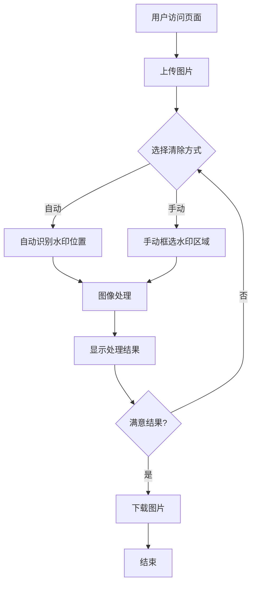

# 图片水印清除系统需求文档

## 1. 项目概述

### 1.1 项目背景
随着数字内容的普及，图片水印清除需求日益增长。本系统旨在提供一个基于Web的图片水印清除工具，使用户能够方便地去除图片中的水印，恢复原始图像内容。

### 1.2 项目目标
- 开发一个功能完善的图片水印清除Web应用
- 支持自动和手动两种水印清除方式
- 提供简洁易用的用户界面
- 保证图片处理质量和效率

### 1.3 技术架构
- **后端框架**: Flask (Python)
- **前端框架**: Vue.js
- **图像处理**: OpenCV
- **通信协议**: RESTful API

## 2. 功能需求

### 2.1 核心功能

#### 2.1.1 图片上传
| 功能点 | 详细描述 | 优先级 |
|--------|----------|--------|
| 点击上传 | 点击按钮选择本地图片文件 | P0 |
| 拖拽上传 | 支持将图片拖拽到指定区域上传 | P1 |
| 格式限制 | 支持JPG、PNG、BMP格式 | P0 |
| 文件大小 | 限制单张图片最大10MB | P1 |
| 预览功能 | 上传后立即显示图片预览 | P0 |

#### 2.1.2 水印清除功能
| 功能点 | 详细描述 | 优先级 |
|--------|----------|--------|
| 自动识别 | 自动识别常见位置的水印并清除 | P1 |
| 手动选择 | 用户手动框选水印区域进行清除 | P0 |
| 多区域清除 | 支持选择多个水印区域 | P2 |
| 修复算法 | 采用图像修复技术填补水印区域 | P0 |
| 质量调节 | 可调节输出图片质量 | P2 |

#### 2.1.3 图片处理
| 功能点 | 详细描述 | 优先级 |
|--------|----------|--------|
| 无损处理 | 保持原图分辨率不降低 | P0 |
| 色彩保持 | 处理后保持原图色彩 | P1 |
| 边缘处理 | 水印边缘平滑过渡 | P1 |
| 批量处理 | 支持批量处理多张图片 | P2 |

#### 2.1.4 结果管理
| 功能点 | 详细描述 | 优先级 |
|--------|----------|--------|
| 结果预览 | 处理后立即显示结果预览 | P0 |
| 图片下载 | 一键下载处理后的图片 | P0 |
| 对比查看 | 原图与处理结果对比显示 | P1 |
| 历史记录 | 保存处理历史记录 | P2 |

### 2.2 用户界面需求

#### 2.2.1 布局要求
- 响应式设计，适配不同屏幕尺寸
- 左右分栏或上下分栏布局
- 清晰的视觉层次
- 现代化的UI设计风格

#### 2.2.2 交互体验
- 加载状态提示
- 处理进度显示
- 操作反馈提示
- 拖拽框选时的实时预览

## 3. 技术需求

### 3.1 后端技术需求

#### 3.1.1 环境要求
```
Python >= 3.8
Flask >= 2.0.0
OpenCV-Python >= 4.5.0
NumPy >= 1.19.0
Pillow >= 8.0.0
Flask-CORS >= 3.0.10
```

#### 3.1.2 API接口设计

| 接口路径 | 方法 | 功能 | 请求参数 | 响应格式 |
|----------|------|------|----------|----------|
| /api/upload | POST | 上传图片 | image (file) | JSON |
| /api/remove-watermark | POST | 去除水印 | filename, method, bbox | JSON |
| /api/download/<filename> | GET | 下载图片 | filename | 文件流 |
| /api/cleanup | POST | 清理临时文件 | filename | JSON |

#### 3.1.3 图像处理算法
- 采用OpenCV的inpaint修复算法
- 支持Telea和Navier-Stokes两种修复方法
- 可配置修复半径参数

### 3.2 前端技术需求

#### 3.2.1 环境要求
```
Node.js >= 14.0.0
Vue >= 3.0.0
Axios >= 0.21.0
```

#### 3.2.2 主要依赖
```json
{
  "vue": "^3.2.0",
  "axios": "^0.24.0",
  "element-plus": "^2.0.0",
  "vue-router": "^4.0.0"
}
```

#### 3.2.3 组件结构
```
src/
├── components/
│   ├── ImageUploader.vue    # 图片上传组件
│   ├── ImageCanvas.vue       # 图片编辑画布
│   ├── WatermarkSelector.vue # 水印选择器
│   └── ResultViewer.vue      # 结果查看器
├── views/
│   └── Home.vue              # 主页面
├── utils/
│   ├── api.js                # API调用
│   └── imageUtils.js         # 图片处理工具
└── App.vue                   # 根组件
```

## 4. 非功能需求

### 4.1 性能需求
| 指标 | 要求 |
|------|------|
| 图片上传响应时间 | ≤ 3秒 |
| 水印处理时间 | ≤ 10秒（10MB图片） |
| 并发处理能力 | 支持10个并发请求 |
| 页面加载时间 | ≤ 2秒 |

### 4.2 安全需求
- 文件类型校验，防止恶意文件上传
- 文件名安全处理，防止路径遍历攻击
- 定期清理临时文件（24小时自动删除）
- API请求频率限制
- 上传文件大小限制

### 4.3 兼容性需求
- 浏览器支持：Chrome 90+，Firefox 88+，Safari 14+
- 操作系统：Windows，macOS，Linux
- 移动设备：响应式适配

### 4.4 可用性需求
- 界面简洁直观，学习成本低
- 提供操作指引和帮助文档
- 错误提示清晰易懂
- 支持键盘快捷键操作

## 5. 数据需求

### 5.1 数据结构

#### 5.1.1 上传图片
```javascript
{
  "filename": "unique_id.jpg",
  "original_name": "original_name.jpg",
  "size": 1024000,
  "upload_time": "2024-01-01 12:00:00",
  "filepath": "/uploads/unique_id.jpg"
}
```

#### 5.1.2 处理请求
```javascript
{
  "filename": "unique_id.jpg",
  "method": "auto|manual",
  "bbox": [x, y, width, height],  // manual模式需要
  "settings": {
    "algorithm": "telea|ns",
    "radius": 3
  }
}
```

#### 5.1.3 处理结果
```javascript
{
  "success": true,
  "output_filename": "result_unique_id.jpg",
  "image_data": "data:image/jpeg;base64,...",
  "processing_time": 2.5
}
```

### 5.2 文件管理
- 临时文件保留时间：24小时
- 定期清理机制：每小时检查并清理过期文件
- 文件命名规则：UUID + 原始扩展名

## 6. 业务流程

### 6.1 基本流程


### 6.2 异常处理流程
- 上传失败：显示错误信息，允许重新上传
- 处理失败：显示错误原因，保留原图
- 下载失败：提供备选下载方式
- 网络异常：自动重试机制

## 7. 界面设计规范

### 7.1 色彩方案
- 主色调：#409EFF (Element Plus 蓝色)
- 成功色：#67C23A
- 警告色：#E6A23C
- 危险色：#F56C6C
- 中性色：#FFFFFF, #F5F7FA, #E4E7ED, #909399, #303133

### 7.2 字体规范
- 中文字体：'Microsoft YaHei', 'PingFang SC', 'Helvetica Neue'
- 英文字体：'Arial', 'sans-serif'
- 标题大小：24px/28px
- 正文大小：14px/20px
- 辅助文字：12px/18px

### 7.3 间距规范
- 页面边距：20px
- 组件间距：16px
- 内部间距：12px
- 小间距：8px

## 8. 测试需求

### 8.1 功能测试
| 测试项 | 测试内容 |
|--------|----------|
| 上传功能 | 各种格式、大小图片上传测试 |
| 清除功能 | 不同类型水印清除效果测试 |
| 下载功能 | 下载结果图片功能测试 |
| 边界测试 | 空图片、超大图片等边界情况 |

### 8.2 性能测试
- 并发用户数：10/50/100
- 响应时间监控
- 资源使用率监控
- 长时间运行稳定性测试

### 8.3 兼容性测试
- 主流浏览器兼容性
- 不同分辨率适配
- 移动端触摸操作测试

## 9. 部署需求

### 9.1 开发环境
```
# 后端启动
python app.py

# 前端启动
npm run serve
```

## 10. 项目里程碑

| 阶段 | 任务 | 预计时间 |
|------|------|----------|
| 第1周 | 需求分析、技术选型、环境搭建 | 3天 |
| 第2-3周 | 后端API开发、图像处理算法实现 | 7天 |
| 第4-5周 | 前端界面开发、交互功能实现 | 7天 |
| 第6周 | 前后端联调、功能测试 | 3天 |
| 第7周 | 性能优化、兼容性测试 | 3天 |
| 第8周 | 部署上线、文档编写 | 2天 |

## 11. 风险与应对

| 风险 | 影响 | 应对措施 |
|------|------|----------|
| 复杂水印清除效果不佳 | 高 | 提供手动选择功能，持续优化算法 |
| 大图片处理性能问题 | 中 | 实现图片压缩，添加进度提示 |
| 并发请求服务器压力 | 中 | 使用队列处理，限制并发数 |
| 文件安全问题 | 高 | 实现文件类型验证，定期清理 |

## 12. 扩展性考虑

### 12.1 功能扩展
- 添加水印添加功能
- 支持更多图片格式
- 集成AI智能识别水印
- 支持视频水印去除

### 12.2 技术扩展
- 使用Redis缓存处理结果
- 引入消息队列处理批量任务
- 使用CDN加速图片访问
- 支持云存储服务

## 13. 附录

### 13.1 参考资料
- OpenCV图像修复文档
- Flask官方文档
- Vue.js官方文档
- Element Plus组件库文档

### 13.2 术语表
| 术语 | 解释 |
|------|------|
| Inpaint | 图像修复技术 |
| BBox | 边界框 |
| ROI | 感兴趣区域 |
| CORS | 跨域资源共享 |

---

**文档版本**: v1.0  
**创建日期**: 2024-01-01  
**最后更新**: 2024-01-01  
**负责人**: 开发团队